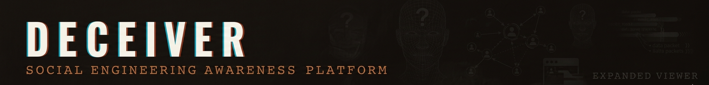

# 🎭 DECEIVER — Social Engineering Training Platform




<p align="center">
  
  
  
  
</p>

---
## Overview

DECEIVER is a **free, interactive, and immersive** social engineering training platform designed to equip employees with the knowledge and skills to **identify, resist, and report** social engineering attacks. The platform covers **8 attack vectors**, **6 live simulations**, and **real-world case studies** to ensure comprehensive training.

## ✨ Key Features

### 🎭 **6 Interactive Training Modules**

| Module                            | Focus               | Description                                                                                                     |
| --------------------------------- | ------------------- | --------------------------------------------------------------------------------------------------------------- |
| **01 — Attack Dossiers**   | Threat Intelligence | Classified files on 8 social engineering attack vectors with tactics, red flags, real-world cases, and defenses |
| **02 — Live Simulations**  | Decision Training   | 6 realistic scenarios where you must make the right security decision under pressure                            |
| **03 — Red Flag Detector** | Pattern Recognition | Interactive email and SMS samples — click on every suspicious element to train your eye                        |
| **04 — Psychology Lab**    | Human Factors       | Deep dive into Cialdini's principles of influence and how attackers weaponize them                              |
| **05 — Defense Playbook**  | Security Protocols  | Verification matrix, critical protocols, and 10 red flags — printable reference                                |
| **06 — Knowledge Quiz**    | Assessment          | 12-question quiz with detailed explanations to reinforce learning                                               |

---

## 📊 **Module 01: Attack Dossiers**

### **8 Social Engineering Attack Vectors**

| #  | Attack                  | Category              | Threat Level | Color       |
| -- | ----------------------- | --------------------- | ------------ | ----------- |
| 01 | **Phishing**      | Email-Based Attack    | 🔴 CRITICAL  | `#c0392b` |
| 02 | **Vishing**       | Voice-Based Attack    | 🔴 HIGH      | `#7c3a1e` |
| 03 | **Smishing**      | SMS-Based Attack      | 🔴 HIGH      | `#4a1a6e` |
| 04 | **Pretexting**    | Identity Deception    | 🔴 CRITICAL  | `#1a3a5c` |
| 05 | **Baiting**       | Physical/Digital Lure | 🟡 MEDIUM    | `#1a4a2e` |
| 06 | **Tailgating**    | Physical Intrusion    | 🔴 HIGH      | `#5c4a1a` |
| 07 | **Quid Pro Quo**  | Service Exchange      | 🟡 MEDIUM    | `#4a2c1a` |
| 08 | **Watering Hole** | Web-Based Targeted    | 🔴 CRITICAL  | `#1a3a3a` |


### **Dossier Contents** 📁

- **Attack Methodology**: 5-step breakdown of how attackers execute each vector
- **Red Flags**: 7+ specific indicators to recognize in the wild
- **Real-World Cases**: 4 historical examples with year and financial impact
- **Defenses**: 6+ actionable countermeasures for organizations and individuals

### **Real-World Case Examples**

- Google & Facebook BEC — $121M stolen via fake invoices
- MGM Resorts Hack — $100M loss from a single helpdesk call
- Robinhood Breach — 7M accounts exposed via vishing
- Stuxnet Delivery — Air-gapped nuclear facility breached via USB baiting


---

## 🎮 **Module 02: Live Simulations**

### **6 Realistic Scenarios**

| #  | Type                     | Title                      | Decision Points                            |
| -- | ------------------------ | -------------------------- | ------------------------------------------ |
| 01 | **Phishing Email** | CEO Wire Transfer Request  | Urgency, authority, look-alike domain      |
| 02 | **Vishing Call**   | IT Helpdesk Password Reset | Authority, fear, ticket number credibility |
| 03 | **Smishing**       | Bank Account Alert         | Fake domain, urgency, personalization      |
| 04 | **Pretexting**     | The New Employee Audit     | Compliance pressure, data dump request     |
| 05 | **Baiting**        | The Parking Lot USB        | Curiosity, labeled bait, physical media    |
| 06 | **Quid Pro Quo**   | The IT Support Call        | Helpfulness exploitation, remote access    |

### **Simulation Features** 🎯

- **Immersive interfaces**:
  - 📧 Email client with chrome toolbar
  - 📞 Voicemail player with transcript
  - 📱 Phone UI with SMS bubbles
- **Multiple choice decisions** with letter indicators (A/B/C/D)
- **Immediate feedback** with detailed explanations
- **Score tracking** (0/6 correct decisions)
- **Visual indicators** for passed/failed scenarios
- **Next scenario navigation**

### **Sample Decision Point**

```
YOUR DECISION
You receive an email from the CEO requesting an urgent wire transfer on Friday afternoon.
What do you do?

[A] Process immediately — it's the CEO
[B] Reply asking for more details
[C] Verify by calling the CEO's known cell number; report to IT Security ✓
[D] Forward to the out-of-office CFO
```


---

## 🔍 **Module 03: Red Flag Detector**

### **Training Samples**

| Sample                 | Type  | Flags   | Description                                                                  |
| ---------------------- | ----- | ------- | ---------------------------------------------------------------------------- |
| **BEC Email**    | Email | 6 flags | Business Email Compromise sample with domain spoofing, urgency, fear tactics |
| **Smishing SMS** | SMS   | 5 flags | Bank impersonation text with fake domain, engagement trap                    |

### **Interactive Features** ✨

- **Clickable red flags** — every suspicious element is highlighted
- **Progressive discovery** — flags stay found once clicked
- **Real-time counter** showing found/total flags
- **Detailed explanations** for each flag when discovered
- **Visual feedback** with found indicators (⚑)

### **Red Flag Examples**

- `m.cheng@digitech-corp.net` — Domain spoofing (digitech-corp.net vs digitech.com)
- `URGENT: Action Required` — Urgency trigger bypassing rational thinking
- `Dear Valued Customer` — Generic greeting (they don't know you)
- `your account will be permanently deleted` — Fear tactic
- `BANK-OF-AMERICA-VERIFY.info` — Fake look-alike domain
- `Reply YES to confirm` — Engagement trap (confirms active number)


---

## 🧠 **Module 04: Psychology Lab**

### **Cialdini's 6 Principles of Influence**

| #  | Principle              | Icon | Tagline                                                           | Defense                                           |
| -- | ---------------------- | ---- | ----------------------------------------------------------------- | ------------------------------------------------- |
| 01 | **Authority**    | 👑   | "We obey those we perceive as having power or expertise"          | Verify through independent channels               |
| 02 | **Urgency**      | ⏰   | "Time pressure bypasses rational decision-making"                 | Pause — urgency is the attacker's biggest weapon |
| 03 | **Social Proof** | 🤝   | "We look to others' behavior to determine what's correct"         | Don't base security on what others allegedly did  |
| 04 | **Liking**       | ❤️ | "We comply more readily with people we like"                      | Apply same standards to pleasant callers          |
| 05 | **Reciprocity**  | 🎁   | "When someone gives us something, we feel obligated to give back" | Unsolicited gifts are not obligations             |
| 06 | **Scarcity**     | 💎   | "We want more of what's available in limited quantities"          | Scarcity is manufactured to prevent thinking      |

### **Lab Features** 🧪

- **Color-coded cards** for each principle
- **Attacker scripts** showing real manipulation language
- **Defense strategies** for each psychological trigger
- **Visual design** with paper texture and classified aesthetic


---

## 📋 **Module 05: Defense Playbook**

### **Verification Matrix** ✅

| Scenario                        | Correct Action                                                |
| ------------------------------- | ------------------------------------------------------------- |
| Urgent request from executive   | Call executive's known cell number — not number in request   |
| IT requests your credentials    | Legitimate IT never needs your password — report immediately |
| Wire transfer request by email  | Verify by phone to known number — no exceptions              |
| Unknown caller from "help desk" | Get name/ticket — call official IT helpdesk number           |
| Vendor needs system access      | Verify via contract management — official provisioning only  |
| Government agent demands action | Request badge number — call agency's official number         |

### **Critical Protocols** ⚡

1. **PAUSE** before acting — urgency is the attacker's biggest weapon
2. **VERIFY** via a different channel — look up the number yourself
3. **REPORT** even if you're unsure — false alarms beat missed attacks
4. **REFUSE** requests for passwords — no legitimate person asks
5. **CHALLENGE** without guilt — it's your professional responsibility
6. **DOCUMENT** what happened — time, number, name, request


### **10 Red Flags — Always Suspect** 🚩

| Icon | Red Flag                                                         |
| ---- | ---------------------------------------------------------------- |
| ⚡   | Any request for urgency that prevents verification               |
| 🔐   | Request for your password, PIN, MFA code, or security questions  |
| 🔇   | Request for secrecy — "don't tell anyone"                       |
| 💳   | Payment request via gift cards, wire, crypto, or Zelle           |
| 💻   | Request to install remote access software for unsolicited caller |
| 📞   | Caller provides a call-back number instead of you looking it up  |
| 😰   | Threats of immediate negative consequences                       |
| 🎁   | Unsolicited help followed by a request                           |
| 📎   | Unexpected attachment or link in email                           |
| 🏦   | Financial transaction bypassing normal authorization             |


---

## 📝 **Module 06: Knowledge Quiz**

### **12 Comprehensive Questions** 📊

| #  | Topic                                   |
| -- | --------------------------------------- |
| 01 | Social Engineering vs Technical Attacks |
| 02 | Password Request Protocol               |
| 03 | Pretexting Definition                   |
| 04 | Phishing Indicators                     |
| 05 | Cialdini's Principles                   |
| 06 | Baiting Attacks                         |
| 07 | Business Email Compromise (BEC)         |
| 08 | Tailgating Psychology                   |
| 09 | Watering Hole Attacks                   |
| 10 | Independent Verification Methods        |
| 11 | Authority + Urgency Combination         |
| 12 | Most Effective Daily Defense            |

### **Quiz Features** ✅

- **Progressive tracking** with progress bar
- **Score display** (X/12)
- **Immediate feedback** with detailed explanations
- **Color-coded results** (✅ correct / ❌ incorrect)
- **Visual indicators** for selected, correct, and wrong answers
- **Letter-based selection** (A/B/C/D)

---

## 🎨 **Design & Aesthetics**

### **Classified Dossier Aesthetic** 📁

- **Paper texture** (`#f5f0e8`) with noise overlay
- **Red stamp accents** (`#c0392b`) for threat indicators
- **Ink colors** (`#1a1410`) for authentic document feel
- **Typewriter fonts** (Courier Prime) for classified documents
- **Oswald** for bold headlines and threat badges
- **Special Elite** for authentic government document feel

### **Visual Elements** 🖼️

- **Classified watermark** ("SENSITIVE") in background
- **Red tape header** with flashing classification
- **Dossier cards** with threat color-coding
- **Stamp effects** for CRITICAL/HIGH threat levels
- **Paper shadows** for depth and realism
- **Flag discovery animations** for red flag detector

### **Attack Type Color Themes** 🎨

| Attack        | Color  | Hex         |
| ------------- | ------ | ----------- |
| Phishing      | Red    | `#c0392b` |
| Vishing       | Brown  | `#7c3a1e` |
| Smishing      | Purple | `#4a1a6e` |
| Pretexting    | Navy   | `#1a3a5c` |
| Baiting       | Green  | `#1a4a2e` |
| Tailgating    | Olive  | `#5c4a1a` |
| Quid Pro Quo  | Sienna | `#4a2c1a` |
| Watering Hole | Teal   | `#1a3a3a` |

---

## 🛠️ **Technical Implementation**

### **Architecture**

```
┌─────────────────────────────────────┐
│      DECEIVER Training Platform      │
├─────────────────────────────────────┤
│                                     │
│  ┌─────────────────────────────┐   │
│  │      Module 1: Dossiers      │   │
│  │  • 8 attack vectors          │   │
│  │  • Real-world cases          │   │
│  │  • Tactical breakdowns       │   │
│  │  • Modal deep dives          │   │
│  └─────────────────────────────┘   │
│                                     │
│  ┌─────────────────────────────┐   │
│  │      Module 2: Simulations   │   │
│  │  • 6 scenarios              │   │
│  │  • Email/SMS/Phone UI       │   │
│  │  • Decision tracking        │   │
│  │  • Score persistence        │   │
│  └─────────────────────────────┘   │
│                                     │
│  ┌─────────────────────────────┐   │
│  │      Module 3: Red Flag      │   │
│  │  • Interactive samples       │   │
│  │  • Clickable detection      │   │
│  │  • Progressive discovery    │   │
│  │  • Explanation engine       │   │
│  └─────────────────────────────┘   │
│                                     │
│  ┌─────────────────────────────┐   │
│  │      Module 4: Psychology    │   │
│  │  • 6 principles             │   │
│  │  • Attacker scripts         │   │
│  │  • Defense strategies       │   │
│  └─────────────────────────────┘   │
│                                     │
│  ┌─────────────────────────────┐   │
│  │      Module 5: Playbook      │   │
│  │  • Verification matrix       │   │
│  │  • Critical protocols       │   │
│  │  • 10 red flags             │   │
│  └─────────────────────────────┘   │
│                                     │
│  ┌─────────────────────────────┐   │
│  │      Module 6: Quiz         │   │
│  │  • 12 questions             │   │
│  │  • Progress tracking        │   │
│  │  • Detailed explanations    │   │
│  └─────────────────────────────┘   │
└─────────────────────────────────────┘
```

### **Key Functions**

```javascript
// Module 1: Dossiers
renderDossiers()           // Render attack vector cards
openDossier(id)            // Open modal with full dossier
closeDossier()             // Close modal

// Module 2: Simulations
initSims()                 // Initialize simulation module
renderSimMissions()        // Render mission list
loadSim(idx)               // Load selected simulation
selectDOpt(simIdx, optIdx) // Select decision option
checkSimDecision(simIdx)   // Submit and evaluate decision
updateSimScore()           // Update score display

// Module 3: Red Flag Detector
initRfd()                  // Initialize red flag detector
loadRfdSample(id)          // Load selected sample
findFlag(sampleId, flagId) // Flag discovered by user

// Module 4: Psychology
initPsych()                // Render psychology cards

// Module 5: Playbook
initPlaybook()             // Render defense playbook

// Module 6: Quiz
initQuiz()                 // Initialize quiz
renderQuiz()               // Render quiz questions
selectQuizAnswer(qIdx, optIdx) // Select answer
submitQuizAnswer(qIdx)     // Submit and evaluate
updateQuizProgress()       // Update progress bar
```

---

## 📊 **Content Breakdown**

| Module                      | Items                     | Interactions                       | Outputs                        |
| --------------------------- | ------------------------- | ---------------------------------- | ------------------------------ |
| **Attack Dossiers**   | 8 vectors × 4 sections   | Card clicks, modal navigation      | Full attack intelligence       |
| **Live Simulations**  | 6 scenarios × 4 choices  | Decision selection, submission     | Score, feedback, next scenario |
| **Red Flag Detector** | 2 samples × 5-6 flags    | Clickable elements, flag discovery | Found flags, explanations      |
| **Psychology Lab**    | 6 principles              | Scroll, read                       | Psychological understanding    |
| **Defense Playbook**  | 3 sections                | Reference                          | Printable protocols            |
| **Knowledge Quiz**    | 12 questions × 4 choices | Answer selection, submission       | Score, progress, explanations  |

---

## 🌐 **Browser Compatibility**

| Browser       | Support                                 |
| ------------- | --------------------------------------- |
| Chrome        | ✅ Full support                         |
| Firefox       | ✅ Full support                         |
| Safari        | ✅ Full support                         |
| Edge          | ✅ Full support                         |
| Opera         | ✅ Full support                         |
| Mobile Chrome | ⚠️ Limited (dossier cards responsive) |
| Mobile Safari | ⚠️ Limited (dossier cards responsive) |

---

## 🚦 **Performance**

- **Load Time**: < 1.8 seconds (zero external dependencies)
- **Memory Usage**: < 45 MB
- **CPU Usage**: Minimal (event-driven)
- **Network**: Zero requests after initial load

---

## 🛡️ **Security Notes**

DECEIVER is a **completely safe** educational platform:

- ✅ No actual social engineering performed
- ✅ All simulations run in browser memory
- ✅ No data collection or tracking
- ✅ No external dependencies
- ✅ Pure HTML/CSS/JavaScript
- ✅ Educational purposes only — learn to recognize and resist attacks

---

## 📝 **License**

MIT License — see LICENSE file for details.

---

## 🙏 **Acknowledgments**

- **Dr. Robert Cialdini** — Influence: The Psychology of Persuasion
- **Kevin Mitnick** — The Art of Deception
- **FBI IC3** — Internet Crime Complaint Center statistics
- **KnowBe4** — Security awareness training inspiration
- **SANS Securing the Human** — Training methodology
- **National Cyber Security Centre (NCSC)** — Phishing guidance

---

## 📧 **Contact**

- **GitHub Issues**: [Create an issue](https://github.com/Willie-Conway/DECEIVER/issues)
- **Website**: https://willie-conway.github.io/DECEIVER/

---

## 🏁 **Future Enhancements**

- [ ] Add more simulation scenarios (10+ total)
- [ ] Include video-based training modules
- [ ] Add manager dashboard for training completion
- [ ] Export certificates of completion
- [ ] Multi-language support
- [ ] Custom scenario builder for security teams
- [ ] Phishing simulation email templates
- [ ] Printable reference cards
- [ ] Audio examples of vishing calls
- [ ] Real-time attack statistics feed

---

<p align="center">
  <strong>🎭 DECEIVER — Transform Security Awareness from Boring to Unforgettable 🎭</strong>
</p>

<p align="center">
  
  
  
</p>

---

*Last updated: March 2025*
